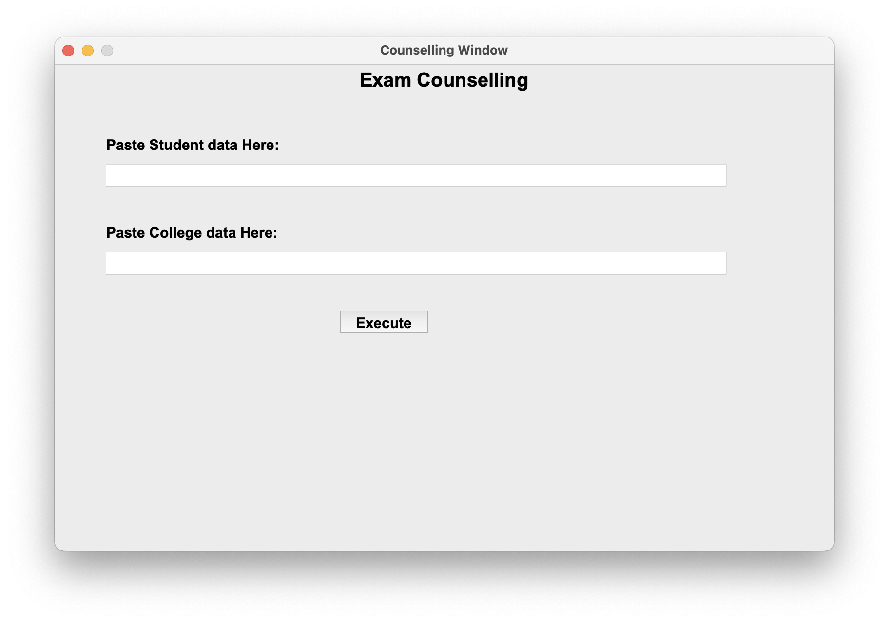

# Exam Counselling Model

## Project Data:

* A Project that is developed using Python.
* A Project that deals with the Seat allocation of the Students.
* An user can provide the details and get the relevant seat allocations.
* This Project mainly contains 3 divisions.

## Programming Language Used:

* **Python**

## Authors:

* **Chirumamilla Deepika**

## Prerequisites:

### Install tkinter Library

**MacOS**

`brew install python-tk`

### Install pandas Library

`pip install pandas`

# Quick Start 🚀

### Initialization Files

1. Prepare a **CSV** file consisting the information of students.
2. Refer "**student_input.csv**" to know all the information to be entered and the format.
3. Let the file be "**Student_Data.csv**".
4. Prepare a **CSV** file consisting the colleges' data.
5. Refer "**college_input.csv**" to know all the information to be entered and the format.
6. Let the file be "**College_Data.csv**".

### Compile the Source Program

* Compile the "**Source.py**" file.
* I would recommend using the following methods based upon your machine.

#### Windows:

* Open the **Command Prompt** by typing **cmd** in search bar.
* Now, run the following commands in the **Command Prompt**
* ```bash
  cd <file_directory>
  python Source.py
  ```

#### MacOS:

* Open terminal from the Finder.
* Now, run the following commands in the **Terminal.**
* ```bash
  cd <file_directory>
  python Source.py
  ```

### Files Input

You will be prompted by an output window that looks something like this:



* Copy the path of "**Student_Data.csv**" that is been created before.
* Paste the address in the designated Dialogue Box.
* Copy the path of "**College_Data.csv**" that is been created before.
* Paste the address in the designated Dialogue Box.
* Press Execute button that's below the Dialogue boxes.

### Get Results

Check the <file_directory>.

Two folders are created namely,

1. College Output
2. Authority Output

"**College Output**" would have the college wise information of allotted seats.

"**Authority Output**" would have the student and college related seat allotment information.
